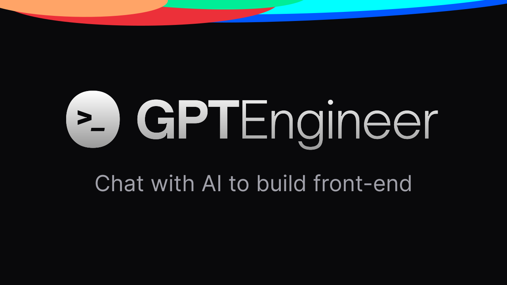

# 🎓 EduQuest - AI-Powered Learning Platform

[](https://reactjs.org/)
[](https://www.typescriptlang.org/)
[](https://tailwindcss.com/)
[](https://vitejs.dev/)

## 🚀 Overview

EduQuest is a cutting-edge educational platform that leverages AI technology to transform the learning experience. It provides personalized learning paths, adaptive content generation, and intelligent assessments for both students and educators.



## ✨ Key Features

- 🤖 **AI-Powered Learning** - Utilizes advanced AI models for content generation and adaptation
- 📚 **Smart Content Management** - Easy document upload and processing for educators
- 💡 **Intelligent Q&A System** - Interactive chat interface for student queries
- 📊 **Adaptive Assessments** - Personalized evaluation based on learning progress
- 🎨 **Modern UI/UX** - Sleek, responsive design with dynamic color schemes
- 🔄 **Real-time Synchronization** - Seamless integration between admin and student portals

## 🛠️ Tech Stack

- **Frontend:**
  - React 18 with TypeScript
  - Tailwind CSS for styling
  - shadcn/ui components
  - Tanstack Query for data management
  - Lucide React for icons
  - React Router for navigation

- **Backend:**
  - Flask
  - OpenAI Integration
  - FAISS for vector similarity search
  - RESTful API architecture

## 🚀 Getting Started

### Prerequisites

- Node.js & npm - [Install with nvm](https://github.com/nvm-sh/nvm#installing-and-updating)
- Python 3.8+ - [Download Python](https://www.python.org/downloads/)

### Frontend Setup

```bash
# Clone the repository
git clone <your-repo-url>

# Navigate to project directory
cd eduquest

# Install dependencies
npm install

# Start development server
npm run dev
```

### Backend Setup

```bash
# Navigate to backend directory
cd backend

# Create virtual environment
python -m venv venv

# Activate virtual environment
# On Windows:
venv\Scripts\activate
# On Unix/MacOS:
source venv/bin/activate

# Install dependencies
pip install -r requirements.txt

# Set environment variables
export OPENAI_API_KEY="your-openai-key"
export GOODFIRE_API_KEY="your-goodfire-key"

# Start Flask server
python app.py
```

## 🌐 Environment Variables

Create a `.env` file in the backend directory:

```env
OPENAI_API_KEY=your_openai_api_key
GOODFIRE_API_KEY=your_goodfire_api_key
```

## 🎯 Usage

1. **Admin Portal:**
   - Upload educational content
   - Process and manage learning materials
   - Monitor student progress

2. **Student Portal:**
   - Access personalized learning content
   - Interact with AI-powered Q&A system
   - Take adaptive assessments

## 🤝 Contributing

Contributions are welcome! Please feel free to submit a Pull Request.

1. Fork the repository
2. Create your feature branch (`git checkout -b feature/AmazingFeature`)
3. Commit your changes (`git commit -m 'Add some AmazingFeature'`)
4. Push to the branch (`git push origin feature/AmazingFeature`)
5. Open a Pull Request

## 📝 License

This project is licensed under the MIT License - see the [LICENSE](LICENSE) file for details.

## 🙏 Acknowledgments

- [OpenAI](https://openai.com/) for AI capabilities
- [Goodfire](https://goodfire.dev/) for API integration
- [shadcn/ui](https://ui.shadcn.com/) for UI components

## 📧 Contact

Project Link: [https://github.com/yourusername/eduquest](https://github.com/yourusername/eduquest)

---